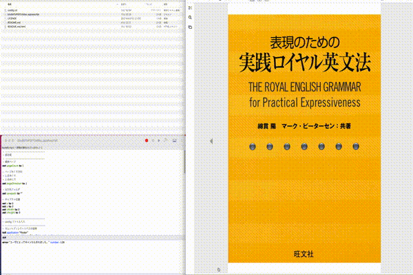

# kindleToPngOnMac

## 使用ツール

* Kindle

## 使い方

1. キャプチャした Kindle 本を開く
1. キャプチャを開始したいページを開く
1. キャプチャしたいページの x 座標, y 座標と幅(width)、高さ(height)を計測する
    * 計測方法は覚書のウィンドウサイズ計測を参照
1. config.txt を編集する
    * pageCount
        * キャプチャするページ数
    * pageDirection
        * ページを開く方向
            * 1:左めくり
            * 2:右めくり
    * x
        * x 座標
    * y
        * y 座標
    * width
        * 幅
    * height
        * 高さ
    * savepath
        * 出力先フォルダ
        * 既に存在しているフォルダは指定できません
1. キャプチャしたいページが表示されている状態でスクリプトを実行する
1. 「実行完了」のダイアログが表示されたらキャプチャ完了

## 覚書

* ウィンドウサイズ計測
    * Command + Shift + 4
    * はじめにx座標とy座標が表示される
    * 左クリックを押し矩形選択をすると選択した箇所からの width と height が表示される
* PDF への変換
    * finder で PDF にした png ファイルを全て選択する
    * 右クリック → クイックアクション → PDF を作成

## 注意

* 実行中は他操作ができません
* 出力先フォルダが既に存在する場合は実行できません

